# 初识 Elasticsearch

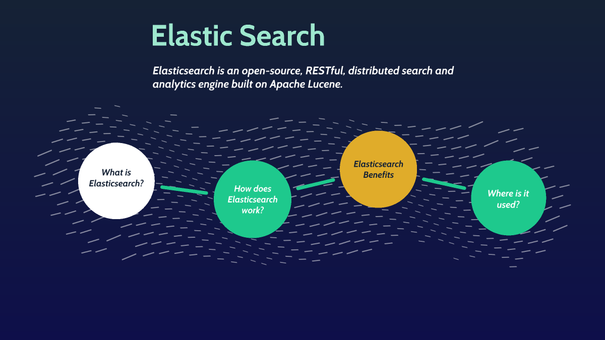

2 个目的:

1. 让与会人员都能自己写点 ES 语句, 立竿见影, 得到想要的统计数据
2. 乐于分享

思路: *a. 了解基本概念; b. 能读懂文中语句; c. 配以演示加深印象; d. 照猫画虎.*

重点: ***非关系型思维***,  ***索引配置(DBA)***,  ***聚合实例***

Ref: https://www.elastic.co/guide/en/elasticsearch/reference/current/index.html

版本间功能变化略大, 建议通读最新官方文档. 若新建, 则建议直接上最新稳定版.

一些特性分享: https://elasticsearch.cn/slides/

以下内容基于版本: `6.4.1`, 最新版本: `7.10.x`, Beta: `8.0`

## 认识

Elasticsearch(ES) 是一个**分布式**的**实时**文档存储和搜索分析引擎.

当每天有10亿数据时, 需要解决的痛点:

- 高并发写入, 有序存储
- 数据量越来越大, 存储横向扩展问题
- 表数据增加, 分库分表复杂度越来越高
- 查询条件越来越多, 索引越来越多
- 检索数据, 统计结果, 速度变慢, 资源占用越来越高
- 全文检索???

ES 特性:

- NoSQL, 扁平化, 文档型, 类似 MongoDB, JSON
- LSM树, 索引(动词)和搜索快速无锁:
  - 倒排索引不可变性, 无需考虑并发写文件问题
  - 倒排(反向)索引则是通过 value 找 key, 正向索引是通过 key 找 value
  - 一旦读入内核系统缓存就留在那, 大部分请求直接命中内存
  - Ref: https://www.cnblogs.com/huaweiyun/p/13679175.html
- 分布式, 集群, 副本备份, 节点竞选
- 分析器, 过滤字符, 分词, 过滤词
- 全文检索, 每个字段都可以被索引与搜索, 高亮结果, 速度快
- 支持上百个节点扩展, 支持 `PB` 级结构化或非结构化数据
- RESTful API

**低成本(学习), 高可用, 少运维**

实时秒级响应, 若慢:

- 数据结构不合理
- 查询语句不优
- 磁盘性能不佳

适用场景:

- 大数据量, 读多写少, 数据几乎无更新的需求
- 复杂场景查询需求, 查询性能有要求, 写入及时性要求不高
- 日志分析, `Elastic Stack` (ES, Logstash, Kibana, Beats)
- 全文检索首选, 个性化推荐, 快, 高亮 (商品, 新闻推荐, GitHub)
- 事件数据和指标统计
- 数据可视化(Kibana)

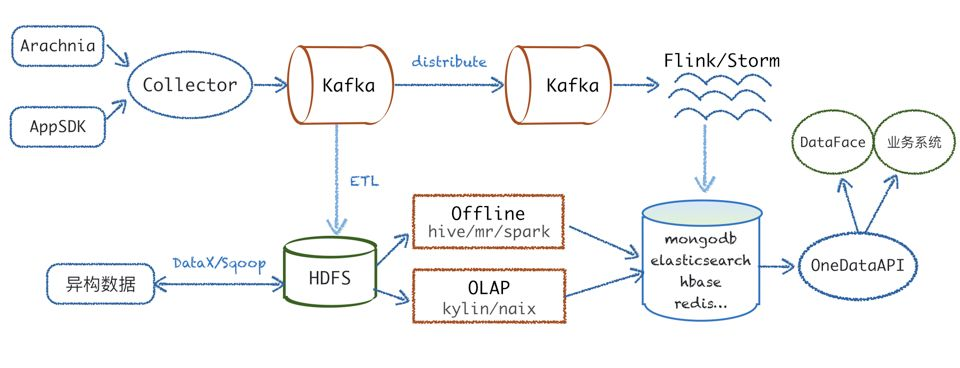

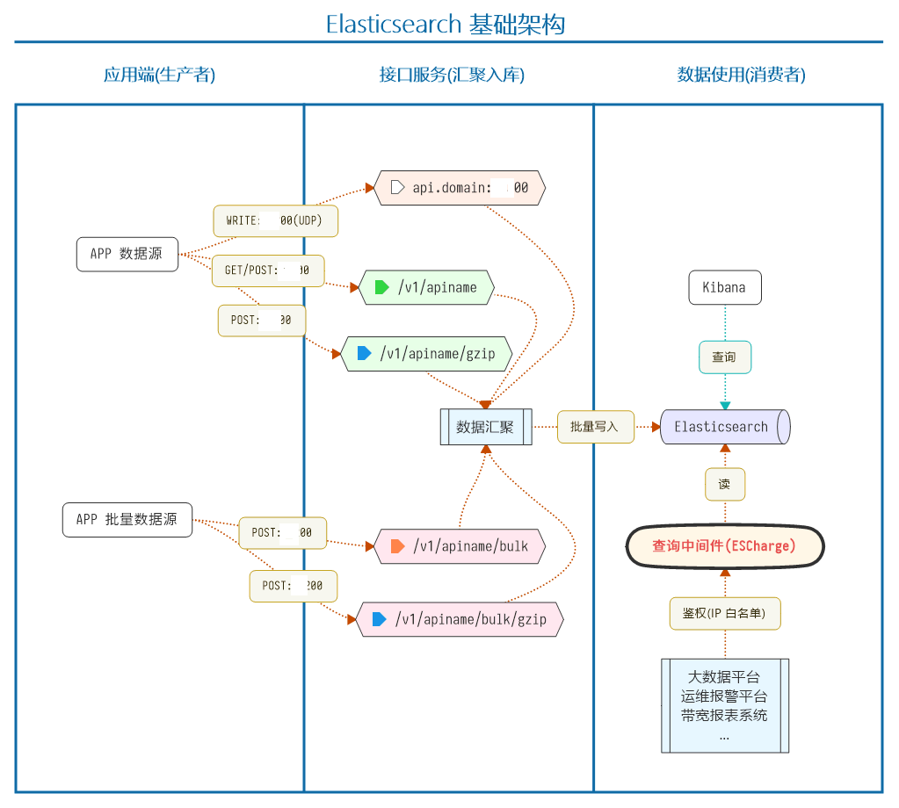

使用前需要知道的:

- 字段类型无法修改
- 写有一定延时, 比如 1 秒
- 吃硬件, 没有 SSD 不要用排序和聚合
- 不支持事务
- 多表关联查询支持弱:
  - 应用层联接, 两次查询 (数据少, 内存码表)
  - 宽表冗余存储 (一对多/多对多)
  - Nested 嵌套类型, 超集合类型 (子文档更新少, 查询多)
  - 父-子关系文档, , Join 类型 (一对多, 子文档更新频繁)
  - Ref: https://www.elastic.co/guide/en/elasticsearch/reference/current/parent-join.html
- 不支持数据的权限管理
- 深分页场景性能差 (结果最多 10000)

PS:  

- 分布式: 一个业务分拆多个子业务, 部署在不同的服务器上
- 集群: 同一个业务, 部署在多个服务器上 

## 概念

- `Cluster` 集群

- `Node` 节点: 每个 ES 实例

- `Shard` 分片: 分布式

- `Replia` 副本: 提高吞吐量, 实现高可用

- `Index` 索引: 类比单个数据库表(一库一表), **名称必须小写**

- `Type` 类型: 弱化了, 之前可类比指数据库中的表. v8.0 取消

- `Document` 文档: 类比一行数据, 相互独立, 文档字段可以不一致:

  ```json
  {
      "Domain": "prod-live-cfentry.playbattlegrounds.com",
      "Exception": "",
      "IP": "222.111.11.3",
      "Mark": {
          "arr": [ 1, 2, 3 ],
          "date": "2020-11-23T10:55:55+08:00"
      },
      "Parsesuccess": false,
      "Port": 443,
      "Readbytes": 0
  }
  ```
  
- `Field` 字段: 即文档 JSON Key

- `Mapping` 映射: 类比数据表结构定义

  - 定义字段类型
    - 字符串: `string`
    - 整数 : `byte`, `short`, `integer`, `long`
    - 浮点数: `float`, `double`
    - 布尔型: `boolean`
    - 日期: `date` 有效的日期字符串
    - 空域: `null`, `[]`, `[null]` 不会被索引
    - `alias`, `nested`, `join`, `range`, `ip`, `version`, `murmur3`, `text`, `geo`, `point`, `shape`, `binary`...
    - 多层级对象
    - 自动猜测类型
    - Ref: https://pdf.us/2018/04/16/897.html
  - 是否索引, 是否存储
  - 分词器:  `ik_smart`, `ik_max_word` 

| ElasticSerach              | Mysql                     |
| -------------------------- | ------------------------- |
| Index                      | Database                  |
| Type                       | Table                     |
| Document                   | Row                       |
| Field                      | Column                    |
| Mapping                    | Schema                    |
| Everything is indexed      | Index(表的索引)           |
| ID                         | Primary Key               |
| Query DSL                  | SQL                       |
| PUT/POST  http://....      | insert into ....          |
| GET http://....            | select * from ...         |
| POST http://... (搜索操作) | selcct * from... like ... |
| PUT  http://....           | update .....              |
| DELETE http://....         | delete from...            |

## 安装

```shell
# 下载
curl -L -O https://artifacts.elastic.co/downloads/elasticsearch/elasticsearch-7.10.0-linux-x86_64.tar.gz
# 解压
tar -xvf elasticsearch-7.10.0-linux-x86_64.tar.gz
# 运行
elasticsearch-7.10.0/bin/elasticsearch -d
```

依赖 JAVA 环境, 集群配置略.

- `9200` API http 服务端口
- `9300` ES 节点内通信端口

信息查询 (RESTful API):

```json
# 集群信息
GET /
curl 192.168.20.103:9200
# 健康情况
GET _cluster/health
curl 192.168.20.103:9200/_cluster/health?pretty
```
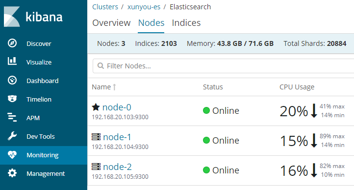

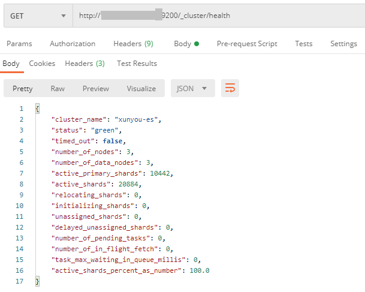

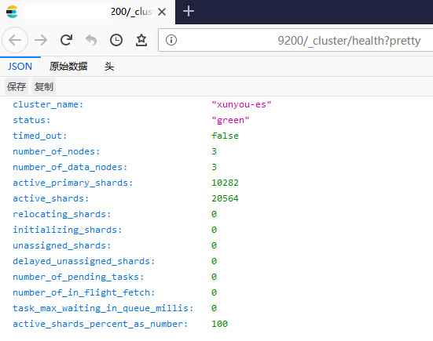

- **`green`** 所有的主分片和副本分片都正常运行
- **`yellow`** 所有的主分片都正常运行, 但不是所有的副本分片都正常运行
- **`red`** 有主分片没能正常运行

PS: 一个机器可以启动多个实例, 一个实例就是一个节点.

```shell
./elasticsearch -Epath.data=data2 -Epath.logs=log2
./elasticsearch -Epath.data=data3 -Epath.logs=log3
```

## 索引

### 1. 新建索引

PS: 数据量大的索引最好按天新建. 不要用数据量非常大的索引, 影响查询效率.

#### 1.1 主分片和副本分片

主分片与副本分片会分布在不同节点, `7.0` 后默认主分片为 `1`, 副本分片为 `0`

```http
PUT /test001
{
   "settings" : {
      "number_of_shards" : 5,
      "number_of_replicas" : 1
   }
}
```

```json
{
  "acknowledged": true,
  "shards_acknowledged": true,
  "index": "test001"
}
```

主分片数为 `5`, 索引创建后无法修改. 每个主分片的复制分片数为 `1`, 可以随时修改.


PS: 增加节点并增加副本分片,  吞吐量更大, 搜索性能更高.

```json
GET xy_auth_monitor_report_201125/_search
{
  "explain": true,
  "from": 0,
  "size": 10,
  "sort": [
    {
      "timestamp": {
        "order": "desc"
      }
    }
  ]
}
```

Ref: https://www.bilibili.com/video/BV1TJ411D7ya

```http
PUT /test001/_settings
{
   "number_of_replicas" : 2
}
```

```http
GET /test001
```

```json
{
  "test001": {
    "aliases": {},
    "mappings": {},
    "settings": {
      "index": {
        "creation_date": "1606335251589",
        "number_of_shards": "5",
        "number_of_replicas": "2",
        "uuid": "okxJQuyMSiS8xStzDMN-fw",
        "version": {
          "created": "6040199"
        },
        "provided_name": "test001"
      }
    }
  }
}
```

#### 1.2 索引的别名 (Index Aliases)

类比关系数据库的视图, 将多个索引按一定过滤条件生成别名对外提供查询:

- 周 KPI 变化图 (week_kpi)
- 用户 B 段报警 (地图)

Ref: https://www.cnblogs.com/Neeo/articles/10897280.html

#### 1.3 映射(Mapping)

```http
GET /test001/_mapping
```

```json
PUT /test001
{
  "settings": {
    "number_of_shards": 3,
    "number_of_replicas": 1
  },
  "mappings": {
    "test001": {
      "properties": {
        "game_id": {
          "type": "long"
        },
        "game_no": {
          "type": "alias",
          "path": "game_id"
        },
        "game_areaid": {
          "type": "long"
        },
        "user_name": {
          "type": "keyword"
        },
        "exception": {
          "type": "text"
        },
        "blob": {
          "type": "binary"
        },
        "end_time": {
          "type": "date"
        },
        "ip_addr": {
          "type": "ip"
        }
      }
    }
  }
}
```

##### 1.3.1 举例 IP:

```json
PUT /test001/test001/1
{
  "game_id": 123,
  "game_areaid": 666,
  "exception": "This is a test.",
  "end_time": "2020-11-26T12:00:00+08:00",
  "ip_addr": "192.168.1.100"
}
```

```json
GET /test001/_search
{
  "query": {
    "term": {
      "ip_addr": "192.168.1.0/24"
    }
  }
}
```

PS: `192.168.1.100`, `0.0.0.0/0`, `192.168.1.123/16`, `192.168.1.0/26`

##### 1.3.2 举例 Date:

默认日期格式: ` strict_date_optional_time||epoch_millis`, 自定义日期格式:

```json
{
  "mappings": {
    "_doc": {
      "properties": {
        "mydate": {
          "type": "date",
          "format": "yyyy-MM-dd HH:mm:ss||yyyy-MM-dd||epoch_millis"
        }
      }
    }
  }
}
```

```json
POST /test001/test001
{
  "end_time": 1606361965000
}
```

```json
POST /test001/test001
{
  "end_time": "2020-11-26"
}
```

```json
GET /test001/_search
{
  "query": {
    "range": {
      "end_time": {
        "gte": "2020-11-26T11:00:00+08:00",
        "lte": "2020-11-26T13:00:00+08:00"
      }
    }
  }
}
```

#### 1.4 分析器

##### 1.4.1 测试分析器

```json
POST _analyze
{
  "tokenizer": "standard",
  "filter": ["lowercase","asciifolding"],
  "text": "Is this déja vu?"
}
```

标准分词, 转为小写, 转为等效 ASCII 字符, 得到 4 个词: `is`, `this`, `deja`, `vu`

```json
POST _analyze
{
  "analyzer": "simple",
  "text": "Is this déja vu?"
}
```

简单分析器无配置, 标准分词后转小写. 常用还有: `whitespace`, `stop`, `pattern`

```json
PUT /test003
{
  "settings": {
    "analysis": {
      "analyzer": {
        "my_email_analyzer": {
          "type": "pattern",
          "pattern": "\\W|_",
          "lowercase": true
        }
      }
    }
  }
}
```

```json
POST /test003/_analyze
{
  "analyzer": "my_email_analyzer",
  "text": "John_Smith@foo-bar.com"
}
```

```json
{
  "tokens": [
    {
      "token": "john",
      "start_offset": 0,
      "end_offset": 4,
      "type": "word",
      "position": 0
    },
    {
      "token": "smith",
      "start_offset": 5,
      "end_offset": 10,
      "type": "word",
      "position": 1
    }
    ...
}
```

##### 1.4.2 自定义分析器

```json
PUT /test002
{
  "settings": {
    "analysis": {
      "char_filter": {
        "&_to_and": {
          "type": "mapping",
          "mappings": [
            "&=> and "
          ]
        }
      },
      "filter": {
        "my_stopwords": {
          "type": "stop",
          "stopwords": [
            "the",
            "a"
          ]
        }
      },
      "analyzer": {
        "my_analyzer": {
          "type": "custom",
          "char_filter": [
            "html_strip",
            "&_to_and"
          ],
          "tokenizer": "standard",
          "filter": [
            "lowercase",
            "my_stopwords"
          ]
        }
      }
    }
  },
  "mappings": {
    "test002": {
      "properties": {
        "html": {
          "type": "text",
          "analyzer": "my_analyzer"
        }
      }
    }
  }
}
```

标准分词结果:

```json
POST _analyze
{
  "analyzer": "standard",
  "text": """<p></p><p class="tit">AI智能加速</p><p class="wz">XunYou全区加速</p>"""
}
```

```json
{
  "tokens": [
    {
      "token": "p",
      "start_offset": 1,
      "end_offset": 2,
      "type": "<ALPHANUM>",
      "position": 0
    },
    {
      "token": "img",
      "start_offset": 4,
      "end_offset": 7,
      "type": "<ALPHANUM>",
      "position": 1
    }
    ...
}
```

使用自定义分析结果:

```json
GET /test002/_analyze
{
  "analyzer": "my_analyzer",
  "text": "<p></p><p class=\"tit\">AI智能加速</p><p class=\"wz\">XunYou全区加速</p>"
}
```

```json
{
  "tokens": [
    {
      "token": "ai",
      "start_offset": 142,
      "end_offset": 144,
      "type": "<ALPHANUM>",
      "position": 0
    },
    {
      "token": "智",
      "start_offset": 144,
      "end_offset": 145,
      "type": "<IDEOGRAPHIC>",
      "position": 1
    }
    ...
}
```

PS: 中文分词需要安装扩展: `medcl/elasticsearch-analysis-ik`

### 2. 删除索引

```http
DELETE /test001,test002
```

```http
DELETE /test00*
```

```shell
curl -XDELETE 'http://192.168.20.103:9200/test00*'
```

```json
{
  "acknowledged": true
}
```

!!! 删除全部索引 !!!: `DELETE /_all`

### 3. 创建文档

#### 3.1 单条数据

须知:

- 索引(动词)文档(数据)时, 若索引不存在, 则自动创建索引. 
- 第一次的数据将自动猜测类型, 往后的数据中相同字段类型必须相同
  - `long` 数字字符串可以与数字字段通用
  - `date` 可以是时间戳(数字或数字字符串)
- 新增文档时字段可以与已定义的 `mapping` 不一致, 索引文档时随意增减
- 文档字段名可以是任何合法字符串, **不能包含英文句号(.)**
- 可以指定文档 `_id`, 也可以自动生成

```json
PUT /test004/test004/1?timeout=5m
{
  "user": "ff",
  "post_date": "2009-11-15T14:12:12",
  "text": "put data to Elasticsearch"
}
```

```json
POST /test004/test004
{
  "uid": 123,
  "post_date": 1606381535000,
  "text": "post data to Elasticsearch"
}
```

#### 3.2 批量数据

***推荐!!!***

语法如下:

```json
action_and_meta_data\n
optional_source\n
action_and_meta_data\n
optional_source\n
....
action_and_meta_data\n
optional_source\n
```

```json
POST _bulk
{"index":{"_index":"test001","_type":"test001","_id":"1"}}
{"user_name":"fufu","game_id":111}
{"delete":{"_index":"test001","_type":"test001","_id":"3"}}
{"update":{"_index":"test001","_type":"test001","_id":"1"}}
{"doc":{"user_name":"ff","game_areaid":777}}
{"create":{"_index":"test001","_type":"test001","_id":"3"}}
{"user_name":"okok"}
{"index":{"_index":"test001","_type":"test001"}}
{"user_name":"test","ip_addr":"1.1.1.1"}

```

```json
{
  "took": 23334,
  "errors": false,
  "items": [
    {
      "index": {
        "_index": "test001",
        "_type": "test001",
        "_id": "1",
        "_version": 1,
        "result": "created",
        "_shards": {
          "total": 2,
          "successful": 2,
          "failed": 0
        },
        "_seq_no": 0,
        "_primary_term": 1,
        "status": 201
      }
    },
    {
      "delete": {
        "_index": "test001",
        "_type": "test001",
        "_id": "3",
        "_version": 1,
        "result": "not_found",
        "_shards": {
          "total": 2,
          "successful": 2,
          "failed": 0
        },
        "_seq_no": 0,
        "_primary_term": 1,
        "status": 404
      }
    },
    {
      "update": {
        "_index": "test001",
        "_type": "test001",
        "_id": "1",
        "_version": 2,
        "result": "updated",
        "_shards": {
          "total": 2,
          "successful": 2,
          "failed": 0
        },
        "_seq_no": 1,
        "_primary_term": 1,
        "status": 200
      }
    },
 ...
```

### 4. 删除文档

一般不建议删除.

#### 4.1 按 `_id` 删除

```http
DELETE /test004/test004/1
```

#### 4.2 筛选后删除

```http
POST test004/_delete_by_query
{
  "query": {
    "match": {
      "uid": 123
    }
  }
}
```

## 查询

### 1. 按 ID 查询

#### 1.1 单 ID 查询

```http
GET /test004/test004/1
```

```http
GET /test004/test004/1?_source=user,*_date
```

```json
{
  "_index": "test004",
  "_type": "test004",
  "_id": "1",
  "_version": 3,
  "found": true,
  "_source": {
    "post_date": "2009-11-15T14:12:12",
    "user": "ff"
  }
}
```

Ref: https://www.elastic.co/guide/en/elasticsearch/reference/6.4/search-uri-request.html

#### 1.2 多 ID 查询

```json
GET /_mget
{
  "docs": [
    {
      "_index": "test004",
      "_type": "test004",
      "_id": "1"
    },
    {
      "_index": "test001",
      "_type": "test001",
      "_id": "1"
    }
  ]
}
```

### 2. 条件查询

#### 2.1 空条件查询

```http
GET /test004/_search
```

```json
GET /test004/_search
{
  "query": {
    "match_all": {}
  }
}
```

#### 2.2 基于模板查询

- 搜索时带模板
- 文件模板
- 预定义模板

```json
POST _scripts/test_tpl001
{
  "script": {
    "lang": "mustache",
    "source": {
      "query": {
        "match": {
          "uid": "{{q_uid}}"
        }
      }
    }
  }
}
```

查看模板:

```http
GET _scripts/test_tpl001
```

使用模板查询:

```json
GET /test004/_search/template
{
  "id": "test_tpl001",
  "params": {
    "q_uid": 123
  }
}
```

删除模板:

```http
DELETE _scripts/test_tpl001
```

多模板批量搜索, 略...

#### 2.3 条件查询

```http
GET /test004/_search?q=uid:123
```

```json
GET /test004/_search
{
  "query": {
    "match": {
      "uid": 123
    }
  }
}
```

```json
GET /test004/_search
{
  "query": {
    "bool": {
      "filter": {
        "term": {
          "uid": 123
        }
      }
    }
  }
}
```

#### 2.4 组合查询

```json
{
    "bool": {
        "must": [],
        "should": [],
        "must_not": [],
    }
}
```

- **`must`** 所有的语句都 *必须(must)* 匹配, 与 `AND` 等价
- **`must_not`** 所有的语句都 *不能(must not)* 匹配, 与 `NOT` 等价
- **`should`** 至少有一个语句要匹配, 与 `OR` 等价

可嵌套:

```sql
SELECT *
  FROM test001
 WHERE game_id = 1616
    OR (game_id = 23646 AND user_name = 'fufu')
```

转为 DSL 语句:

```json
GET /test001/_search
{
  "query": {
    "bool": {
      "should": [
        { "term": { "game_id": { "value": 1616 }}},
        {
          "bool": {
            "must": [
              { "term": { "game_id": { "value": 111 }}},
              { "term": { "user_name": { "value": "ff" }}}
            ]
          }
        }
      ] } } }
```

#### 2.5 查询与过滤

```json
GET _search
{
  "query": { 
    "bool": { 
      "must": [
        { "match": { "name": "Jim" }}, 
        { "match": { "city": "Guangzhou" }}  
      ],
      "filter": [ 
        { "term":  { "weight": "60" }}, 
        { "range": { "age": { "gte": "18" }}} 
      ]
    }
  }
}
```

一些概念:

- 叶查询子句: 可单独使用, 对特定字段查询特定值: `term`, `match`, `range`
- 复合查询子句: 组合查询, 逻辑组合: `bool`
- 查询上下文: `query` 查询并计算分值, 按相关度排序, `_score`
- 过滤上下文: `filter` 仅判断是否满足查询条件, `yes` or `no`, 不评分, 也不关心排序, 查询结果可以被缓存, 性能高
- 精确匹配时最好用过滤语句 `filter`, `term`, `terms`
- 全文检索用 `match`, `multi_match`
- 无值 `missing` (`IS_NULL`) , 有值 `exists` (`NOT IS_NULL`)
- Ref: https://www.elastic.co/guide/cn/elasticsearch/guide/current/_queries_and_filters.html

更多查询:

- 相关度控制: 权重, 评分

- 近似匹配: 短语匹配, 多值字段, 相关词

- 部分匹配: 前缀查询, 通配符及正则查询

  ```json
  {
      "query": {
          "prefix": {
              "postcode": "XY" 
          }
      }
  }
  ```

  ```json
  {
      "query": {
          "regexp": {
              "postcode": "XY[0-9].+" 
          }
      }
  }
  ```

#### 2.6 输出结果控制

`_source`, `stored_fields`, `script_fields` 结果字段

```json
GET /test001/_search
{
  "query": {
    "term": {
      "game_id": {
        "value": 111
      }
    }
  },
  "_source": {
    "includes": [ "game_*", "ip_addr" ],
    "excludes": [ "end_time" ]
  },
  "script_fields": {
    "game_id_plus": {
      "script": {
        "lang": "painless",
        "source": "doc['game_id'].value + 10000"
      }
    },
    "game_areaid_test": {
      "script": {
        "lang": "painless",
        "source": "doc['game_areaid'].value + params.prefix",
        "params": {
          "prefix": 20000
        }
      }
    },
    "game_areaid_alias": {
      "script": "params['_source']['game_areaid']"
    }
  }
}
```

```json
{
    "_index": "test001",
    "_type": "test001",
    "_id": "1",
    "_score": 1,
    "_source": {
        "game_areaid": 777,
        "game_id": 111
    },
    "fields": {
        "game_id_plus": [
            10111
        ],
        "game_areaid_test": [
            20777
        ],
        "game_areaid_alias": [
            777
        ]
    }
}
```

`highlight` 高亮

```json
GET /test004/_search
{
    "query" : {
        "match": { "text": "Elasticsearch" }
    },
    "highlight" : {
        "fields" : {
            "text" : {}
        }
    }
}
```

```json
"highlight": {
  "text": [
    "put data to <em>Elasticsearch</em>"
  ]
}
```

#### 2.7 查询 18-20 时中欧接口带宽数据

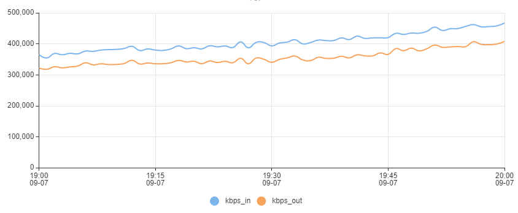

```json
GET bw_collect_201126/_search
{
  "query": {
    "bool": {
      "must": [
        {
          "range": {
            "time": {
              "gte": "2020-11-26T18:00:00.000+08:00",
              "lt": "2020-11-26T20:00:00.000+08:00"
            }
          }
        },
        {
          "term": {
            "interface.keyword": {
              "value": "10GE1/0/111"
            }
          }
        }
      ]
    }
  },
  "sort": [
    {
      "time": {
        "order": "asc"
      }
    }
  ],
  "size": 1000,
  "_source": ["client_ip", "kbps*", "time"]
}
```

SQL 方式查询:

```json
POST /_xpack/sql?format=txt
{
  "query":"SELECT client_ip, kbps_in, kbps_out, time FROM bw_collect_201126 WHERE time >= '2020-11-26T18:00:00.000+08:00' and time < '2020-11-26T20:00:00.000+08:00' and interface.keyword='10GE1/0/111' ORDER BY time ASC"
}
```

如果中欧带宽有多个接口呢?

```json
POST /_xpack/sql?format=txt
{
  "query":"SELECT kbps_in, kbps_out, time, interface FROM bw_collect_201126 WHERE time >= '2020-11-26T18:00:00.000+08:00' and time < '2020-11-26T20:00:00.000+08:00' and (interface.keyword='10GE1/0/111' or interface.keyword='Vlanif1777') ORDER BY time ASC"
}
```

SQL 转为 DSL 结构化查询:

```http
POST /_xpack/sql/translate
{...}
```

```json
GET bw_collect_201126/_search
{
  "query": {
    "bool": {
      "must": [
        {
          "range": {
            "time": {
              "from": "2020-11-26T18:00:00.000+08:00",
              "to": "2020-11-26T20:00:00.000+08:00"
            }
          }
        },
        {
          "bool": {
            "should": [
              {
                "term": {
                  "interface.keyword": {
                    "value": "10GE1/0/111"
                  }
                }
              },
              {
                "term": {
                  "interface.keyword": {
                    "value": "Vlanif1777"
                  }
                }
              }
            ]
          }
        }
      ]
    }
  },
  "sort": [
    {
      "time": {
        "order": "asc"
      }
    }
  ],
  "size": 1000,
  "_source": ["client_ip","kbps_in","kbps_out","time"]
}
```

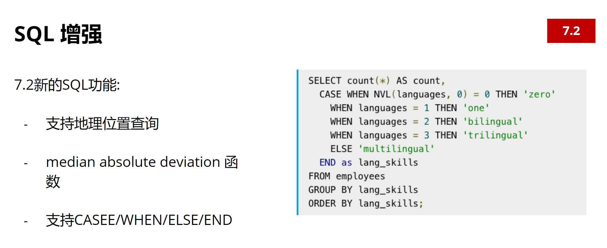

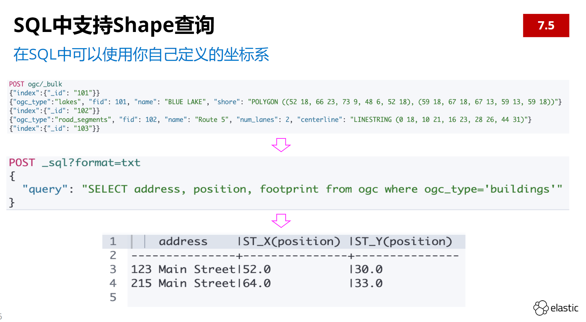

#### 2.8 最近 10 分钟 Nagios 报警

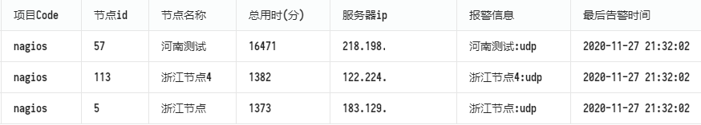

```json
GET /monitor_alarm_info_201127/_search
{
  "query": {
    "bool": {
      "must": [
        {
          "term": {
            "code": {
              "value": "nagios"
            }
          }
        },
        {
          "range": {
            "time": {
              "gte": "now-10m"
            }
          }
        }
      ]
    }
  }
}
```

### 3. 分页

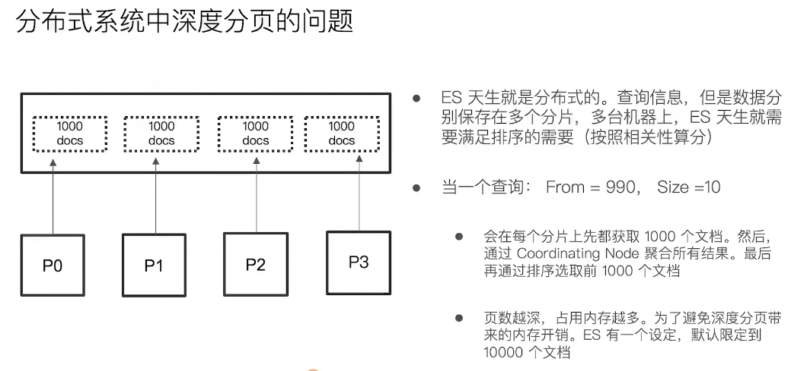

```json
GET /tcpproxy_201125/_search
{
  "query": {
    "match": {
      "IP": "222.111.11.58"
    }
  },
  "from": 0,
  "size": 5,
  "sort": [
    {
      "StartTime": {
        "order": "desc"
      }
    }
  ]
}
```

`size` 大小不能超过 `index.max_result_window` 参数的设置, 默认为: `10000`

- 实时获取顶部的部分文档, 如最新的订单. 用 `from` `to`
- 需要全部文档, 如导出数据, 用 `Scroll`
- 深度分页, 用 `Search After`

### 4. 排序

```json
GET xy_201125,xy_201126/_search
{
  "query": {
    "term": {
      "data.game.game_id": {
        "value": 1616
      }
    }
  },
  "sort": [
    {
      "data.node_id": {
        "order": "asc"
      },
      "data.speed_report_0.delays": {
        "order": "desc",
        "mode": "avg"
      }
    }
  ]
}
```

若 `order` 有多个值(数组), 取平均值排序.

PS: 数组中数据类型必须一致. `[1, 2, 3]` 查看 `mapping`:

```json
"delays": {
  "type": "long"
}
```

多索引: `_all`, `xy_*`, `xy_20*`, `xy_2011*,xy_201030`

***建议: 去除一切不必要的嵌套, 文档只使用一级 `key-value`***

## 聚合

一些概念:

- `Buckets` 桶, 满足条件的文档集合, 类似于 `GROUP BY`
- `Metrics` 指标, 对桶内文档进行统计计算, 类似于 `COUNT()`, `SUM()`
- `Pipeline` 聚合其他聚合的输出以及相关指标的聚合
- `aggregations` 缩写为 `aggs` 聚合关键字

```json
"aggregations" : {
    "<aggregation_name>":
        "<aggregation_type>":
            <aggregation_body>
        }
        [,"meta" : {  [<meta_data_body>] } ]?
        [,"aggregations" : { [<sub_aggregation>]+ } ]?
    }
    [,"<aggregation_name_2>" : { ... } ]*
}
```

### 1. 中欧峰值带宽统计

前提: 每分钟采集每设备每接口的数据到 ES.

思路: 交换机接口 `10GE1/0/111` 的流入流出带宽最大值 `max`, `stats`

```json
GET bw_collect_201126/_search
{
  "size": 0,
  "query": {
    "match": {
      "interface.keyword": "10GE1/0/111"
    }
  },
  "aggs": {
    "max_kbps_in": {
      "max": {
        "field": "kbps_out"
      }
    }
  }
}
```

```json
"aggregations": {
    "max_kbps_in": {
      "value": 2637288
    }
  }
```

也可以按峰值排序取前 5 条数据:

```json
GET bw_collect_201126/_search
{
  "size": 5,
  "query": {
    "match": {
      "interface.keyword": "10GE1/0/111"
    }
  },
  "sort": [
    {
      "kbps_in": {
        "order": "desc"
      }
    }
  ],
  "_source": ["client_ip","kbps_out","time"]
}
```

```json
{
    "_index": "bw_collect_201126",
    "_type": "bw_collect_201126",
    "_id": "RpxSA3YBtrCG7JwuhwMm",
    "_score": null,
    "_source": {
        "kbps_out": 3677867,
        "client_ip": "100.119.112.200",
        "time": "2020-11-26T11:34:00+08:00"
    },
    "sort": [
        696326
    ]
}
```

### 2. 统计美国用户分布情况

`terms`, `cardinality`

```json
GET userspd_201126/_search
{
  "size": 0,
  "query": {
    "bool": {
      "must": [
        {
          "term": {
            "country_c.keyword": "united states" 
          }
        }
      ],
      "must_not": [
        {
          "term": {
            "prov_c.keyword": "unkown" 
          }
        }
      ]
    }
  },
  "aggs": {
    "by_prov_c": {
      "terms": {
        "field": "prov_c.keyword",
        "size": 100
      },
      "aggs": {
        "by_user_distinct": {
          "cardinality": {
            "field": "u_name.keyword"
          }
        }
      }
    }
  }
}
```

```json
  "aggregations": {
    "by_prov_c": {
      "doc_count_error_upper_bound": 0,
      "sum_other_doc_count": 0,
      "buckets": [
        {
          "key": "california",
          "doc_count": 1396244,
          "by_user": {
            "value": 2728
          }
        },
        {
          "key": "new york",
          "doc_count": 1271922,
          "by_user": {
            "value": 3456
          }
        },
```

### 3. 按游戏和区服统计加速人数

`terms`, `cardinality` 多重聚合

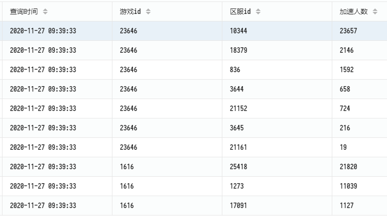

```json
GET xy_201127/_search
{
  "size": 0,
  "_source": false,
  "query": {
    "bool": {
      "filter": [
        {
          "term": {
            "type.keyword": "speed_report"
          }
        },
        {
          "terms": {
            "data.game_id": [1616, 23646]
          }
        },
        {
          "range": {
            "_ctime": {
              "gte": "2020-11-27T09:34:33",
              "lt": "2020-11-27T09:39:33"
            }
          }
        }
      ]
    }
  },
  "aggs": {
    "aggs_hits": {
      "terms": {
        "field": "data.game_id",
        "size": 10000
      },
      "aggs": {
        "aggs_gamearea": {
          "terms": {
            "field": "data.game_area_id",
            "size": 10000
          },
          "aggs": {
            "distinct_user_name": {
              "cardinality": {
                "field": "data.user_name.keyword"
              }
            }
          }
        }
      }
    }
  }
}
```

```json
  "aggregations": {
    "aggs_hits": {
      "doc_count_error_upper_bound": 0,
      "sum_other_doc_count": 0,
      "buckets": [
        {
          "key": 23646,
          "doc_count": 117709,
          "aggs_gamearea": {
            "doc_count_error_upper_bound": 0,
            "sum_other_doc_count": 0,
            "buckets": [
              {
                "key": 10344,
                "doc_count": 116209,
                "distinct_user_name": {
                  "value": 23657
                }
              },
```

### 4. 域名单位时间内访问次数趋势图

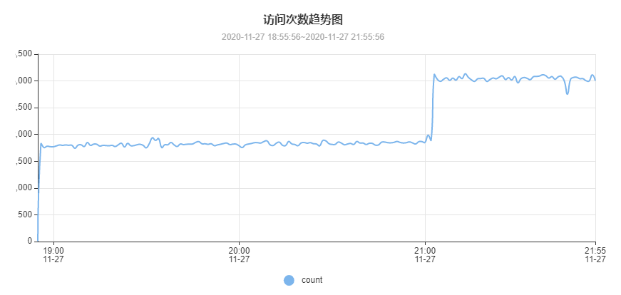

`date_histogram`, 按时间间隔聚合, 日期直方图

```json
GET tcpproxy_201127/_search
{
  "query": {
    "bool": {
      "filter": [
        {
          "range": {
            "StartTime": {
              "gte": "2020-11-27T18:55:00+08:00",
              "lt": "2020-11-27T21:55:00+08:00"
            }
          }
        },
        {
          "term": {
            "Domain.keyword": "www.google.com"
          }
        }
      ],
      "must_not": [
        {
          "term": {
            "Vpppid.keyword": ""
          }
        }
      ]
    }
  },
  "aggs": {
    "aggs_hits": {
      "date_histogram": {
        "field": "StartTime",
        "interval": "minute"
      }
    }
  },
  "size": 0
}
```

```json
  "aggregations": {
    "aggs_hits": {
      "buckets": [
        {
          "key_as_string": "2020-11-27T10:55:00.000Z",
          "key": 1606474500000,
          "doc_count": 1643
        },
        {
          "key_as_string": "2020-11-27T10:56:00.000Z",
          "key": 1606474560000,
          "doc_count": 1684
        },
```

### 5. 指定时间范围内域名解析结果 IP 访问分布图

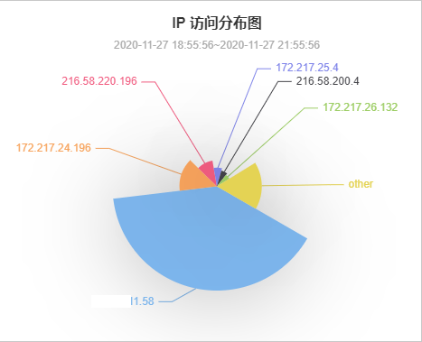

```json
GET tcpproxy_201127/_search
{
  "query": {
    "bool": {
      "filter": [
        {
          "range": {
            "StartTime": {
              "gte": "2020-11-27T18:55:00+08:00",
              "lt": "2020-11-27T21:55:00+08:00"
            }
          }
        },
        {
          "term":{
            "Domain.keyword": "www.google.com"
          }
        }
      ],
      "must_not": [
        {
          "term": {
            "Vpppid.keyword": {
              "value": ""
            }
          }
        }
      ]
    }
  },
  "aggs": {
    "aggs_hits": {
      "terms": {
        "field": "IP.keyword",
        "size": 20
      }
    }
  },
  "size": 0
}
```

```json
  "aggregations": {
    "aggs_hits": {
      "doc_count_error_upper_bound": 58,
      "sum_other_doc_count": 11865,
      "buckets": [
        {
          "key": "111.11.11.58",
          "doc_count": 175187
        },
        {
          "key": "172.22.124.96",
          "doc_count": 126836
        },
```

- `doc_count_error_upper_bound` 返回结果之外还有聚合没有返回
- `sum_other_doc_count` 此次聚合没有统计到的文档数

### 6. 智能DNS服务器解析情况分析

源数据:

```json
{
    "conf_records": [
        "5.5.5.5",
        "6.6.6.6"
    ],
    "dns_check_result": "True",
    "dns_domain": "monitor.yw.test",
    "dns_ip": "123.234.111.222",
    "dns_name": "上海LB",
    "local_records": [
        "5.5.5.5",
        "6.6.6.6"
    ]
}
```

`terms`, `top_hits`

```json
GET dns_monitor_201126/_search
{
  "size": 0,
  "aggs": {
    "dns_check": {
      "terms": {
        "field": "dns_check_result.keyword",
        "order": {
          "_count": "asc"
        }
      },
      "aggs": {
        "dns_domain": {
          "terms": {
            "field": "dns_domain.keyword",
            "order": {
              "_count": "desc"
            }
          },
          "aggs": {
            "dns_name": {
              "terms": {
                "field": "dns_name.keyword",
                "order": {
                  "_count": "desc"
                }
              },
              "aggs": {
                "top": {
                  "top_hits": {
                    "size": 1
                  }
                }
              }
            }
          }
        }
      }
    }
  }
}
```

```json
  "aggregations": {
    "dns_check": {
      "doc_count_error_upper_bound": 0,
      "sum_other_doc_count": 0,
      "buckets": [
        {
          "key": "True",
          "doc_count": 11206,
          "dns_domain": {
            "doc_count_error_upper_bound": 0,
            "sum_other_doc_count": 0,
            "buckets": [
              {
                "key": "monitor.yw.test",
                "doc_count": 8338,
                "dns_name": {
                  "doc_count_error_upper_bound": 0,
                  "sum_other_doc_count": 0,
                  "buckets": [
                    {
                      "key": "上海DNS1",
                      "doc_count": 1434,
                      "top": {
                        "hits": {
                          "total": 1434,
                          "max_score": 1,
                          "hits": [
                            {
                              "_index": "dns_monitor_201126",
                              "_type": "dns_monitor_201126",
                              "_id": "TyC8_nUBtrCG7JwuGll8",
                              "_score": 1,
                              "_source": {
                                "_cip": "222.111.222.111",
                                "_ctime": "2020-11-26T00:09:38Z",
                                "_gtime": "2020-11-26T00:09:38+08:00",
                                "conf_records": [
                                  "5.5.5.5",
                                  "6.6.6.6"
                                ],
                                "dns_check_result": "True",
                                "dns_domain": "monitor.yw.test",
                                "dns_ip": "123.234.111.222",
                                "dns_name": "上海DNS1",
                                "local_records": [
                                  "5.5.5.5",
                                  "6.6.6.6"
                                ]
                              }
                            }
                          ]
                        }
                      }
                    },
```

`top_hits` Ref: https://blog.csdn.net/ctwy291314/article/details/82773180

### 7. 节点报警次数 TOP 10

`top_hits`

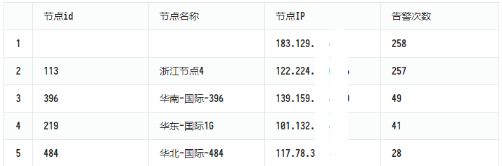

```json
GET /monitor_alarm_info_201127/_search
{
  "size": 0,
  "query": {
    "bool": {
      "filter": [
        {
          "terms": {
            "code": ["nagios","smokeping","system_monitor"]
          }
        }
      ]
    }
  },
  "aggs": {
    "node_ip": {
      "terms": {
        "field": "node_ip.keyword",
        "order": {
          "_count": "desc"
        }
      },
      "aggs": {
        "top": {
          "top_hits": {
            "size": 1
          }
        }
      }
    }
  }
}
```

### 8. 用户 B 段测速报警

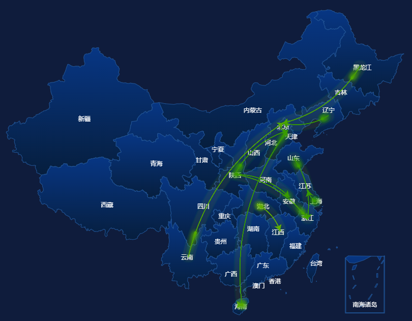

`scripted_metric`:

- `init_script` 收集任何文件之前执行, 可选
- `map_script` 每个收集的文档执行一次, 必须
- `combine_script`  文档收集完成后, 每个分片执行一次, 必须
- `reduce_script` 所有分片均返回结果后, 在协调节点上执行一次, 必须

```json
GET userspd_201127/_search
{
  "size": 0,
  "query": {
    "bool": {
      "filter": [
        {
          "range": {
            "rcv_time": {
              "gte" : "now-1h"
            }
          }
        },
        {
          "term": {
            "country_c": "china"
          }
        },
        {
          "term": {
            "country_s": "china"
          }
        }
      ],
      "must_not": [
        {
          "term": {
            "n_avg": 65535
          }
        },
        {
          "term": {
            "prov_c.keyword": "china"
          }
        },
        {
          "term": {
            "prov_s.keyword": "china"
          }
        }
      ]
    }
  },
  "aggs": {
    "by_prov_c": {
      "terms": {
        "field": "prov_c.keyword",
        "size": 2
      },
      "aggs": {
        "by_prov_s": {
          "terms": {
            "field": "prov_s.keyword",
            "size": 2
          },
          "aggs": {
            "los_percent": {
              "scripted_metric": {
                "init_script": "params._agg.map = new HashMap();",
                "map_script": "if(!params._agg.map.containsKey('total'))params._agg.map.put('total',0);if(!params._agg.map.containsKey('los'))params._agg.map.put('los',0);  params._agg.map.put('total',params._agg.map['total']+1);if(doc['n_los'].value > 0 ) params._agg.map['los'] = params._agg.map['los'] + 1",
                "combine_script": "return params._agg.map",
                "reduce_script": "int total = 0; int los=0; for (a in params._aggs) { total += a['total'];los+=a['los'] } return Math.floor(los*0.1*1000/total);"
              }
            }
          }
        }
      }
    }
  }
}
```

```json
  "aggregations": {
    "by_prov_c": {
      "doc_count_error_upper_bound": 844905,
      "sum_other_doc_count": 22258607,
      "buckets": [
        {
          "key": "js",
          "doc_count": 2910301,
          "by_prov_s": {
            "doc_count_error_upper_bound": 3797,
            "sum_other_doc_count": 659311,
            "buckets": [
              {
                "key": "sh",
                "doc_count": 1411625,
                "los_percent": {
                  "value": 2
                }
              },
              {
                "key": "gd",
                "doc_count": 839365,
                "los_percent": {
                  "value": 4
                }
              }
            ]
          }
        },
```

### 9. 统计 LOL 加速前小于 60ms 用户平均延时

`script`, `stats`, v6.5 支持 `median_absolute_deviation`

```json
GET xy_201125/_search
{
  "size": 0,
  "query": {
    "bool": {
      "must": [
        {
          "match": {
            "data.game_id": "1616"
          }
        },
        {
          "match": {
            "type.keyword": "speed_report"
          }
        }
      ],
      "filter": [
        {
          "script": {
            "script": {
              "source": "doc['data.speed_report_0.avg_delay'].value > 0",
              "lang": "painless"
            }
          }
        },
        {
          "script": {
            "script": {
              "source": "doc['data.speed_report_0.avg_delay'].value < 60",
              "lang": "painless"
            }
          }
        }
      ]
    }
  },
  "aggs": {
    "stats_delay": {
      "stats": {
        "field": "data.speed_report_0.avg_delay"
      }
    }
  }
}
```

```json
  "aggregations": {
    "avg_delay": {
      "count": 14840620,
      "min": 1,
      "max": 59,
      "avg": 30.474570199685164,
      "sum": 1147515814
    }
  }
```

还有好多招式, Ref: 

- https://pdf.us/2018/05/16/1050.html
- https://learnku.com/docs/elasticsearch73/7.3/article-11/6889
- https://xiaoxiami.gitbook.io/elasticsearch/ji-chu/36aggregationsju-he-fen-679029


*(网络部.2020.11.28)*

*fufu*